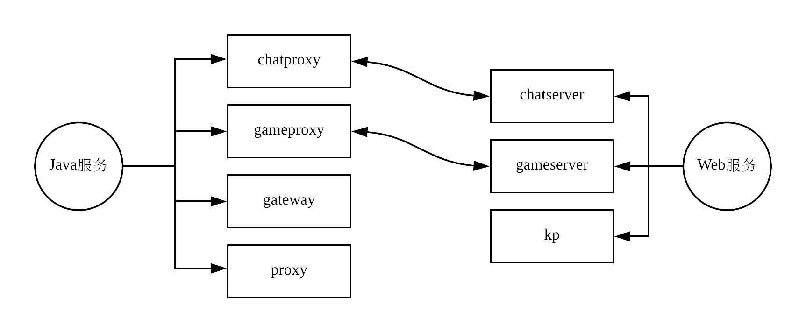

# 非容器部署
本次非容器部署是在NA-test3号机上进行的，其配置内存：8G
## 非容器部署服务列表

## 1.软件环境部署
### 查看linux系统版本号：
```
$ cat /etc/redhat-release
CentOS Linux release 7.4.1708 (Core)
```
### 安装Java
```
sudo yum install -y java-1.8.0-openjdk.x86_64

$ java -version
java version "1.8.0_162"
Java(TM) SE Runtime Environment (build 1.8.0_162-b12)
Java HotSpot(TM) 64-Bit Server VM (build 25.162-b12, mixed mode)
```
### 增加软件资源库
```
获取软件包：wget http://dl.fedoraproject.org/pub/epel/6/x86_64/epel-release-6-8.noarch.rpm
安装源：sudo rpm -ivh epel-release-6-8.noarch.rpm
```
### 安装memcached
```
sudo yum install -y memcached.x86_64
```
### 安装Redis
```
sudo yum install -y redis.x86_64
```
### 安装Tomcat-7
```
获取资源包：wget http://apache.mirrors.ionfish.org/tomcat/tomcat-7/v7.0.88/bin/apache-tomcat-7.0.88.tar.gz
安装：tar -zxvf apache-tomcat-7.0.88.tar.gz
mv apache-tomcat-7.0.88 tomcat7 && mv tomcat7 /home/centos/longsl/app/
```
### 安装MySQL
```
sudo yum install -y http://www.percona.com/downloads/percona-release/redhat/0.1-3/percona-release-0.1-3.noarch.rpm
sudo yum install -y Percona-Server-server-56.x86_64
启动mysql服务：sudo mysqld start
```
### 安装Python脚本运行所需环境
```
sudo yum -y install python-redis.noarch
sudo yum -y install mysql-connector-python.noarch
```
## 2.部署proxy和gameproxy
### 部署proxy
1. 上传proxy.tar包到`/home/centos/longsl/app`
2. 将proxy.tar解压：`mkdir proxy && mv proxy.tar proxy` && `tar xvf proxy.tar`
3. 增加执行权限：`chmod u+x /home/centos/longsl/app/proxy/startup && chmod u+x /home/centos/longsl/app/proxy/startproxy.sh`
4. 启动proxy服务：`./startup`
### 部署Tomcat相关server（仅包含：KP）
1. 上传kp.tar包到`/home/centos/longsl/app`
2. 将kp.tar解压：`mkdir kp && mv kp.tar kp && tar xvf kp.tar`
3. 将kp资源包放到Tomcat-7的webapps文件夹下：`mv kp/ tomcat7/webapps`
### 部署Redis和Memcached
#### 启动Redis
1. 修改redis配置文件，允许其在后台执行：`sudo vi /etc/redis.conf` 修改：daemonize yes
2. 启动redis-server：`sudo /usr/bin/redis-server /etc/redis.conf`
3. 验证redis是否启动成功：`sudo netstat -lntp | grep 6379`
#### 启动Memcached
1. 启动Memcached：`sudo /usr/bin/memcached -d -u root -m 512 -p 11211 -c 5000`
注释信息：
-d 选项是启动一个守护进程
-m 是分配给Memcache使用的内存数量，单位是MB，这里是1024MB，默认是64MB
-u 是运行Memcache的用户，这里是root
-l 是监听的服务器IP地址，默认应该是本机
-p 是设置Memcache监听的端口，默认是11211，最好是1024以上的端口
-c 选项是最大运行的并发连接数，默认是1024，这里设置了10240，按照你服务器的负载量来设定     
-P是设置保存Memcache的pid文件，我这里是保存在 /tmp/memcached.pid，也可以启动多个守护进程，不过端口不能重复
2. 验证Memcached是否启动成功：`sudo netstat -lntp | grep 11211`

## 3. 部署MySQL
### 新建数据库及账户
1. 初始化登录MySQL：`mysql -uroot` 默认密码为空，可以直接登录MySQL。
2. 接下来修改MySQL-root用户的密码：`set password for 'root'@'localhost' = password('123456');`
3. 创建数据库账户：`CREATE USER 'kpdbuser'@'localhost' IDENTIFIED BY '123456';` localhost表示该用户只能从本地访问数据库，%表示该用户可以从任意网络访问数据库
4. 创建数据库：`CREATE DATABASE `kpdb` /*!40100 DEFAULT CHARACTER SET utf8mb4 */;`
5. 给数据库kpdbuser账户赋予访问权限：`GRANT ALL ON *.* TO 'kpdbuser'@'localhost' IDENTIFIED BY '123456' WITH GRANT OPTION;` `GRANT ALL ON *.* TO 'kpdbuser'@'127.0.0.1' IDENTIFIED BY '123456' WITH GRANT OPTION;` `GRANT ALL ON *.* TO 'kpdbuser'@'%' IDENTIFIED BY '123456' WITH GRANT OPTION;`这三个分别表示给kpdbuser设置localhost、127.0.0.1和任意的外网登录许可权限。
6. 刷新数据库权限：`flush privileges;`
### 执行MySQL脚本
建库脚本分为两部分：table.sql和config.sql，分别存放在NA-DM机的`/usr/app/scripts/kpdb/`目录
通过kpdbuser用户登录并指定kpdb数据库，再通过`source config.sql`来执行脚本。先执行tables.sql脚本导入表结构，再执行config.sql脚本导入配置文件。
### 备份数据库
`mysqldump -uroot -p kpdb > /home/centos/longsl/kpdb.dump`
### 还原数据库
`mysql -uroot -p kpdb < /home/centos/longsl/kpdb.dump`

## 4. 部署GameProxy

## 5. 部署ChatProxy

## 6. 部署GateWay

## 7. 部署ProxyServer

## 8. 生成竞技场机器人和超神之路机器人
1. 在NA-DM机上`/usr/app/pythonTool`目录下获取机器人脚本。
2. 部署脚本文件到本地机器，然后修改目录下的config文件。
3. 通过`python main.python`来执行脚本。

## 9. 启动Info部署单元（Tomcat）
`/home/centos/longsl/app/tomcat7/bin/catalina.sh run`     以监控模式打开tomcat
`/home/centos/longsl/app/tomcat7/bin/startup.sh`          以后台模式打开tomcat

如果tomcat正常开启，log中不会出现异常信息。记住：查看$TOMCAT_HOME/logs目录下的日志信息，各个web项目的日志都在这个目录下。
如果出现DB相关的异常请检查mysql数据库连接，以及各个部署单元的配置文件等。

停止Tomcat，需要使用`kill -9 $pid`命令。

## 10.开放端口
使用KP客户端连接Proxy服务器所在的外网IP，端口号为9000；防火墙开放9000端口
`sudo /sbin/iptables -I INPUT -p tcp --dport 9000 -j ACCEPT`

## 11.Nginx资源更新服务器部署
`sudo yum install -y nginx`

## 12.测试
通过Unity打开KP客户端程序进行测试

注意事项：
1. Redis和Memecache都是用来加载缓存的，但是两者的适用地方不同。在插入机器人到redis和数据库时，需要redis处理清空状态，而且要注意启动步骤是：先进行插入机器人操作，这期间会插入绝大部分机器人（9500个），再启动KP项目（第一次启动期间还会将500个机器人插入USER表中），因此最后在数据库中查看USER表，应该是10000条记录。
2. redis和memecache重启后其内部的缓存数据会丢失。
